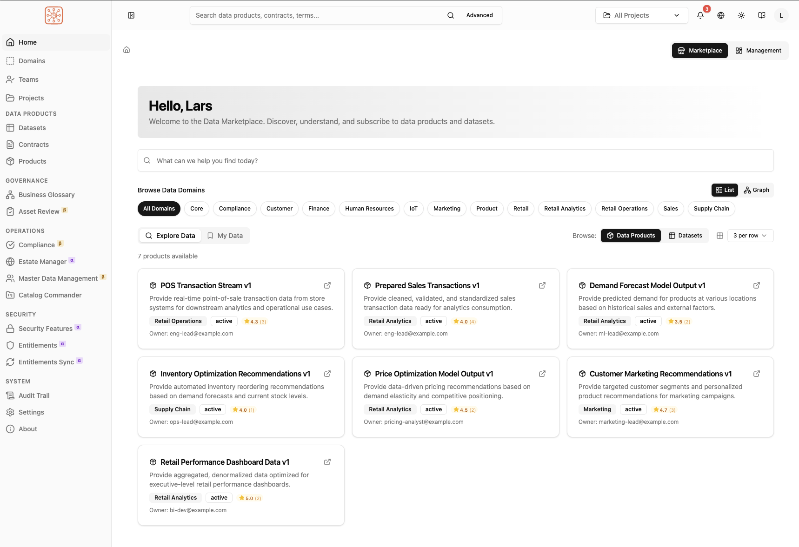

# Ontos

A comprehensive data governance and management platform built for Databricks Unity Catalog.



## Overview

**Ontos** provides enterprise teams with the tools to organize, govern, and deliver high-quality data products following Data Mesh principles and industry standards like [ODCS](https://github.com/bitol-io/open-data-contract-standard) (Open Data Contract Standard) and [ODPS](https://github.com/bitol-io/open-data-product-standard) (Open Data Product Specification).

## Key Features

### 📊 Data Products
Group and manage related Databricks assets (tables, views, functions, models, dashboards) as cohesive, consumable products with clear ownership and lifecycle management.

### 📝 Data Contracts
Define formal specifications for data assets with schema definitions, quality rules, SLOs, and semantic meaning following the ODCS v3.0.2 standard.

### 📦 Datasets
Register and group existing data assets across systems (Unity Catalog, Snowflake) and environments (dev, staging, prod), bridging physical assets to formal contracts.

### 🏢 Organizational Structure
Organize data work using **Domains**, **Teams**, and **Projects** aligned with your organizational structure and data mesh architecture.

### 🧠 Semantic Models
Link technical data assets to business concepts through a knowledge graph, enabling semantic search and maintaining a shared vocabulary.

### ✅ Compliance Automation
Define and enforce governance policies using a declarative DSL (Domain-Specific Language). Run automated compliance checks with configurable actions (tagging, notifications, enforcement).

### 🔍 Asset Review Workflows
Enable Data Stewards to formally review and approve assets before production promotion, with AI-assisted analysis and full audit trails.

### 🤖 AI Integration (MCP)
Expose your data governance platform to AI assistants via the Model Context Protocol (MCP), enabling natural language queries and automation.

## Architecture

Ontos is designed to run as a **Databricks App**:

- **Frontend**: React + TypeScript with Tailwind CSS and Shadcn UI
- **Backend**: Python + FastAPI with SQLAlchemy ORM
- **Database**: PostgreSQL (or Databricks Lakebase in production)
- **Integration**: Native Databricks SDK integration for Unity Catalog operations

## Quick Start

### Prerequisites

- Python 3.10 - 3.12
- Node.js 18+
- Yarn (v1.x Classic)
- Hatch (Python build tool)
- PostgreSQL (for local development)

### Installation

```bash
# Clone the repository
git clone https://github.com/larsgeorge/ontos.git
cd ontos

# Install frontend dependencies
cd src/frontend
yarn install

# Copy and configure environment
cd ../..
cp .env.example .env
# Edit .env with your configuration
```

### Running Locally

**Terminal 1 - Frontend:**
```bash
cd src/frontend
yarn dev:frontend
```

**Terminal 2 - Backend:**
```bash
cd src
hatch -e dev run dev-backend
```

- Frontend: http://localhost:3000
- Backend API: http://localhost:8000
- API Docs: http://localhost:8000/docs

### Deploying to Databricks

```bash
databricks bundle deploy --var="catalog=app_data" --var="schema=app_ontos"
databricks apps deploy <app-name>
```

## Documentation

| Document | Description |
|----------|-------------|
| [User Guide](src/docs/USER-GUIDE.md) | Comprehensive guide for end users |
| [Configuring](CONFIGURING.md) | Environment variables, database setup, and deployment |
| [Contributing](CONTRIBUTING.md) | Development setup, commit guidelines, and release process |
| [API Docs](http://localhost:8000/docs) | Interactive API documentation (when running locally) |
| [Compliance DSL Guide](src/docs/compliance-dsl-guide.md) | Quick start for writing compliance rules |
| [Compliance DSL Reference](src/docs/compliance-dsl-reference.md) | Complete DSL syntax reference |

## User Roles

Ontos supports role-based access control with predefined roles:

| Role | Description |
|------|-------------|
| **Admin** | Full system access |
| **Data Governance Officer** | Broad governance oversight |
| **Data Steward** | Review and approve contracts/products |
| **Data Producer** | Create and manage data products |
| **Data Consumer** | Discover and use data products |
| **Security Officer** | Security and entitlements management |

## Project Structure

```
ontos/
├── src/
│   ├── backend/           # FastAPI backend
│   │   ├── src/
│   │   │   ├── common/    # Shared utilities
│   │   │   ├── controller/# Business logic managers
│   │   │   ├── db_models/ # SQLAlchemy models
│   │   │   ├── models/    # Pydantic API models
│   │   │   ├── repositories/ # Database access
│   │   │   └── routes/    # API endpoints
│   │   └── alembic/       # Database migrations
│   ├── frontend/          # React frontend
│   │   └── src/
│   │       ├── components/# UI components
│   │       ├── views/     # Page components
│   │       ├── hooks/     # Custom React hooks
│   │       ├── stores/    # State management
│   │       └── types/     # TypeScript definitions
│   ├── docs/              # Documentation
│   └── scripts/           # Build and utility scripts
├── docs/                  # Additional documentation
├── CONTRIBUTING.md        # Contributing guidelines
└── README.md              # This file
```

## Standards & Specifications

Ontos implements and integrates with these standards:

- **[ODCS](https://github.com/bitol-io/open-data-contract-standard)** - Open Data Contract Standard (v3.0.2)
- **[ODPS](https://github.com/bitol-io/open-data-product-standard)** - Open Data Product Specification
- **[MCP](https://modelcontextprotocol.io/)** - Model Context Protocol for AI integration

## Contributing

We welcome contributions! Please see our [Contributing Guide](CONTRIBUTING.md) for:

- Development setup instructions
- Commit message conventions (we use [Conventional Commits](https://www.conventionalcommits.org/))
- Versioning and release process
- Code style guidelines
- Pull request process

## License

This project is licensed under the Databricks License - see the [LICENSE.txt](LICENSE.txt) file for details.

---

**Maintained by**: [Databricks](https://databricks.com)
