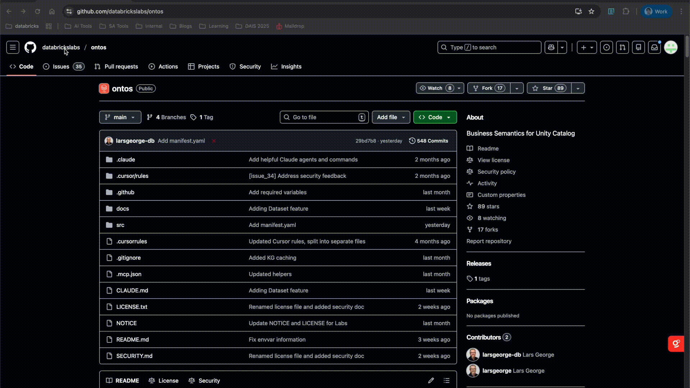
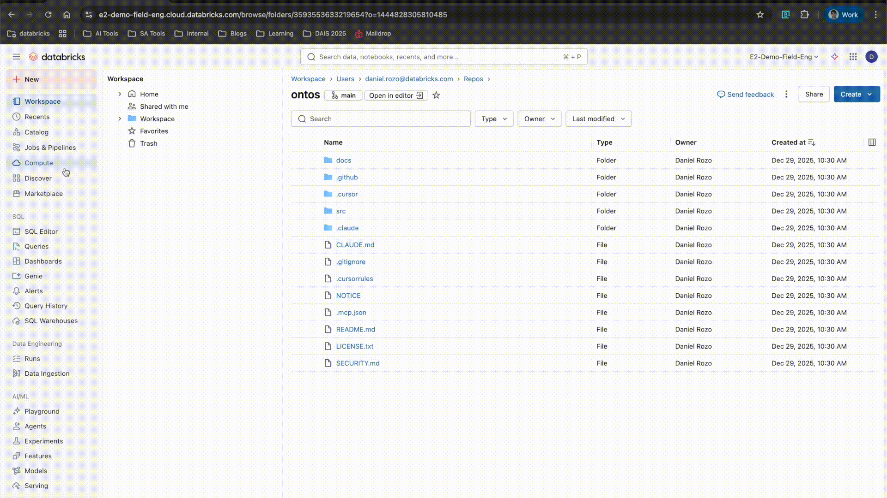
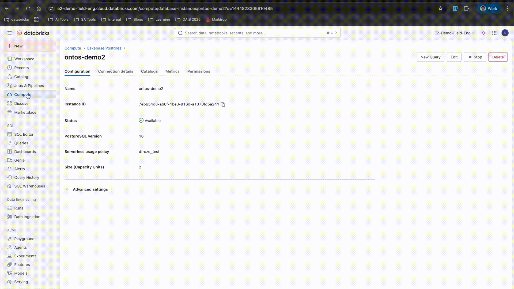

# Setup on Databricks

The following section will walk you through the basic installation and configuration of Ontos in a Databricks workspace. 

## Prerequisites

The following items must be available on the workspace where Ontos will be deployed:
- Access to a foundational model API (e.g., databricks-claude-sonnet-4-5)
- Access to a DBSQL Serverless or DBSQL Pro endpoint
- Permissions: 
    - User that deploys application has Workspace admin rights
    - `APP_ADMIN_DEFAULT_GROUPS` in `app.yaml` corresponds to IdP admin group

## Configuration process

### Step 1: Clone Ontos repository {#dbsetup_step1}
   1. From the official Databricks Labs [page](https://github.com/databrickslabs/ontos.git), clone the ontos repository. In GitHub, select *Clone* and copy the HTTPS URL. 
   2. Select *Workspace* from the left-hand side menu in Databricks
   3. In your preferred directory, click on the *Create* button in the top-right corner and select *Git Folder*
   4. Paste the HTTPS URL from GitHub and provide a git folder name (optional). You should see the folder created and all files cloned into your Databricks workspace, a shown below. 



### Step 2: Setup Lakebase Database {#dbsetup_step2}
:::info[**Reusing Lakebase Instance**]
If you prefer to reuse an existing instance and schema/database, you can **skip** this step and proceed to [Step 3](#dbsetup_step3).
:::
   1. Select *Compute* from the left-hand side menu in Databricks
   2. Go to the *Lakebase Provisioned* tab
   3. Click on *Create database instance*. 
   4. Provide a name to the instance, size in CUs, and additional configurations (if needed)



   5. Once the instance is created, create the required database for Ontos using the SQL Editor for PostgreSQL or the psql client to run the following commands:

   ```sql
    DROP DATABASE IF EXISTS "<your_app_database_name>";
    CREATE DATABASE "<your_app_database_name>";
    ```
:::tip[**Supported SQL Clients**]
In this example, `your_app_database_name` can be app_ontos. To access the database instance using client tools, refer to the official Databricks [documentation](https://docs.databricks.com/aws/en/oltp/instances/query/psql).
:::

### Step 3: Create App {#dbsetup_step3}

   1. Select *Compute* from the left-hand side menu in Databricks
   2. Go to the Apps tab and click on *Create App*
   3. From the app creation page, select *Create a custom app*
   4. Give the app a name and a description (optional). Then select *Next: Configure*
   5. On the App Resources page, click *Add Resource*. To get started, you’ll need to add the following basic resources:

| Reource | Description | Key |
| -------- | -------- | -------- |
| SQL Warehouse    | DBSQL instance resource from the workspace. The value is mapped to the environment variable *DATABRICKS_WAREHOUSE_ID* | sql-warehouse   |
| Database    | Lakebase PostgreSQL instance resource. The value is mapped to the environment variable *POSTGRES_HOST*   | database   |
| Serving endpoint    | Foundation model serving endpoint. The value is mapped to the environment variable *LLM_ENDPOINT*   | serving-endpoint  |

:::warning

Make sure the parameter **PGSCHEMA** on the `app.yml` file corresponds to your Lakebase database/schema name.

:::

   6. Click on _Create App_ and review deployment in the app main page



:::info[**Environment Variables Reference**]
For a full reference and purpose of each environment configuration variable, refer to the [Environment Variables](../dev_guide/env_var) section.
:::

### Step 4: Ontos Application Deployment {#dbsetup_step4}

   1. On the main application page of your newly created app, go to the Authorization tab and copy the UUID of the pre-created Service Principal. The name follows the syntax `app-id <app name>`. 
   2. On the SQL query used on Step 2, run the following statement: 

   ```sql
   GRANT CREATE ON DATABASE “<your_app_database>” TO  "<UUID of SP>";
   ```

   3. Back to your main app Overview page, click on *Deploy* locate in the top-right corner. 
   4. Select the `ontos/src` directory of the Git Folder you created in Step 1. 
   5. Once the Deployment is complete, your application will be Available and Running on the URL shown in the Overview app page. 


## Next Steps

Congratulations! 🎉 

You have successfully completed the basic setup of Ontos on Databricks. 🚀


